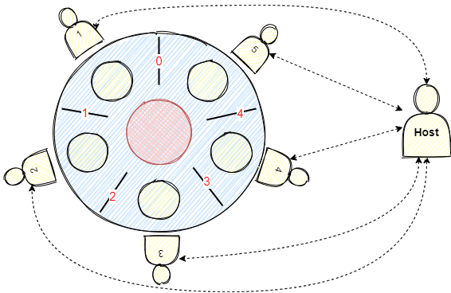

# Dining Philosopher's problem 




There are 5 philosophers having their dinner at a round table with one chopstick between each adjacent pair of philosophers. A philosopher can only eat when they have both left and right chopsticks. In other words, while one philosopher is eating, his two adjacent friends have to wait. After eating he puts both the chopsticks down to let the others eat. There is a limit number of philosophers that can eat concurently. In a larger scale, while there are more than 5 philosopher, this number may differ in range of 1 to as many as possible. 

The deadlock may occur when each philosopher simultaneously pickups one chopstick and waits for another chopticks forever. A host which is executes in its own goroutine is introduced to resolve the deadlock situation. The host  plays a role on coordinating the dining process. In order to give a philosopher permission to eat, host needs to check for all the conditions, including whether 2 adjacent of that philosopher are not eating and how many philosophers are eating at that time. 


 ### Implementation
 
Note: This design is scalable, i.e number of philosophers, number of courses per Philosopher, and number philosophers that eat concurrently can be changed.

```gotemplate
const (
	noP             = 5 //number of Philosophers
	noCoursesPerP   = 3 // Number of courses per Philosophers
	noPEatAtOneTime = 2 // number of Philosophers eating concurrently
)
```
 